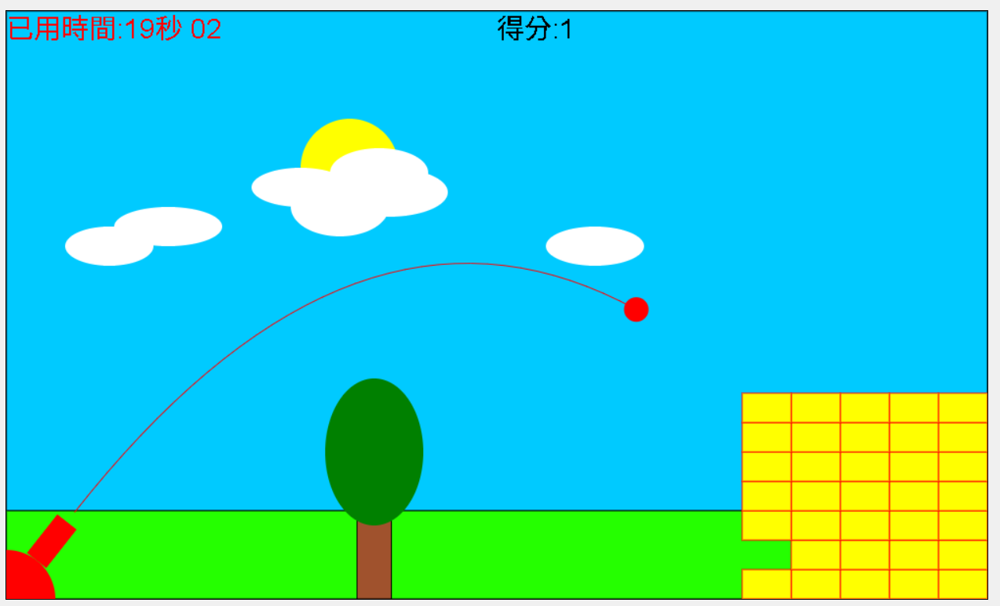

# 山寨憤怒鳥遊戲

使用 HTML、CSS、JavaScript 開發的 Canvas 射擊遊戲，玩家需控制憤怒鳥的發射角度和力量，摧毀目標建築物。

遊戲利用物理模擬算法實現拋物線運動軌跡，並通過精確碰撞檢測系統處理鳥與目標物之間的互動。

<a href="https://opming7788.github.io/AngryBirds_KnockOff/AngryBird.html">進入遊戲</a>

## 使用技術：

- **HTML / CSS**：基本頁面結構與樣式設計
- **JavaScript**：遊戲邏輯控制與物理模擬實現
- **Canvas API**：所有遊戲元素的繪製與動畫效果
- **事件監聽**：實現滑鼠角度瞄準與力量控制系統

## 實現演算法：

- **物理模擬**：重力加速度與拋物線運動計算
- **碰撞檢測**：精確的物體邊界檢測系統
- **旋轉矩陣**：實現砲塔的角度旋轉與瞄準功能
- **軌跡模擬**：實時顯示發射軌跡與速度視覺化

## 遊戲特點：

- 直觀的滑鼠瞄準與力量控制機制
- 實時計分與計時系統
- 破壞建築物獲得分數，撞擊樹木扣分
- 達到目標破壞數量後顯示遊戲結果

遊戲完全使用原生 JavaScript 實現，無需任何外部庫或框架，展示了基於 Canvas 的 2D 遊戲開發基礎技術。

## 遊戲截圖

